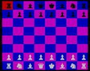

# Chess

A full featured chess game built entirely on the command-line.

## Usage

To play the game, clone the repository and execute the game file, `game.rb` in the terminal.

## Gameplay

Full rule enforcements. Illegal moves are blocked. Players are notified is state of check.

## Screen Shots

